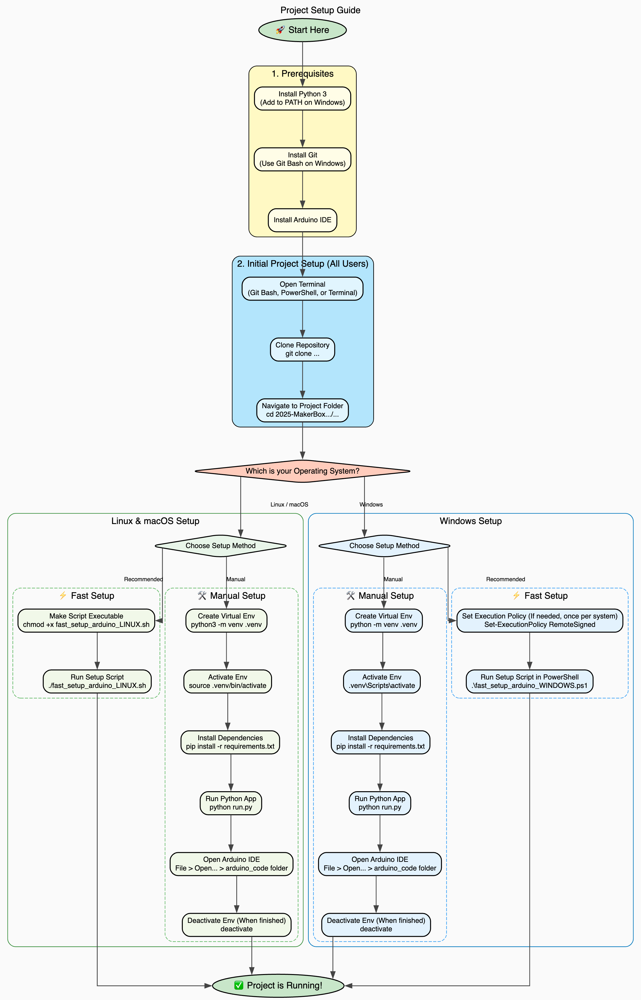

# `lao_messages_app_variable_width` Setup Guide & 'Fast Setup' Explanation
Author: Oliver Lee, Technical contributors: Oliver Lee

This guide explains how to set up and run the `lao_messages_app_variable_width` project on both Linux-based systems and Windows.



## **Prerequisites**

Before you begin, please ensure you have the following software installed on your system.

* **Python 3:** Required to run the application's backend scripts.
    * Download from the official [Python website](https://www.python.org/downloads/).
    * **Windows Users:** During installation, make sure to check the box that says **"Add Python to PATH"**.

* **Git:** Needed to clone the project repository from GitHub.
    * Install from the official [Git website](https://git-scm.com/downloads).
    * **Windows Users:** We recommend using **Git Bash**, which is included with the Git for Windows installation.

* **Arduino IDE:** Required to upload the generated code to your Arduino board.
    * Download from the official [Arduino Software page](https://www.arduino.cc/en/software).

---

## **Step 1: Initial Project Setup (All Users)**

These first three steps are required for **all operating systems** and both setup methods.

1.  **Open Your Terminal**
    * On Windows, we recommend opening **Git Bash** or **PowerShell**.
    * On macOS or Linux, open your standard **Terminal**.

2.  **Clone the Repository**
    Navigate to a suitable directory, then run:
    ```bash
    git clone https://github.com/Technology-for-the-Poorest-Billion/2025-MakerBox-Bytecode.git
    ```

3.  **Navigate to the Project Folder**
    ```bash
    cd 2025-MakerBox-Bytecode/lao_messages_app_variable_width
    ```

After completing these steps, proceed to the instructions for your specific operating system below.

---

## **Linux & macOS Setup**

Choose one of the two methods below. The fast setup is recommended.

### Method 1: Fast Setup ⚡

This method uses a shell script to automate the entire setup.

1.  **Make the Script Executable:**
    ```bash
    chmod +x fast_setup_arduino_LINUX.sh
    ```

2.  **Run the Setup Script:**
    ```bash
    ./fast_setup_arduino_LINUX.sh
    ```
    The script will create the environment, install packages, run the app, and open the Arduino IDE for you.

<br>

### Method 2: Manual Setup 🛠️
<details>
<summary>Click to expand for manual Linux & macOS instructions</summary>

1.  **Create a Python Virtual Environment:**
    ```bash
    python3 -m venv .venv
    ```

2.  **Activate the Virtual Environment:**
    ```bash
    source .venv/bin/activate
    ```
    Your terminal prompt should now show `(.venv)`.

3.  **Install Python Dependencies:**
    ```bash
    pip install -r requirements.txt
    ```

4.  **Run the Python Application:**
    ```bash
    python run.py
    ```

5.  **Launch Arduino IDE:**
    * Open the Arduino IDE application.
    * Go to `File > Open...` and navigate to the project's `arduino_code` folder.
    * Open the main sketch file: `arduino_code.ino`.

6.  **Deactivate Virtual Environment:** When finished, you can exit the environment by typing:
    ```bash
    deactivate
    ```
</details>

---

## **Windows Setup**

Choose one of the two methods below. The fast setup is recommended.

### Method 1: Fast Setup ⚡

This method uses a PowerShell script to automate the entire setup.

1.  **Run the Setup Script in PowerShell:**
    * **Note:** You may need to adjust your system's execution policy first. If the script fails, open PowerShell as an **Administrator** and run `Set-ExecutionPolicy RemoteSigned`. Press `Y` to confirm. You only need to do this once.
    * In your regular (non-admin) PowerShell terminal, run the script:
    ```powershell
    .\fast_setup_arduino_WINDOWS.ps1
    ```
    The script will handle the rest!

<br>

### Method 2: Manual Setup 🛠️
<details>
<summary>Click to expand for manual Windows instructions</summary>
    
1.  **Create a Python Virtual Environment:**
    ```bash
    python -m venv .venv
    ```

2.  **Activate the Virtual Environment:**
    * In **Git Bash** or **PowerShell**:
        ```bash
        source .venv/Scripts/activate
        ```
    * In **Windows Command Prompt (CMD)**:
        ```cmd
        .\.venv\Scripts\activate
        ```
    Your command prompt should now be prefixed with `(.venv)`.

3.  **Install Python Dependencies:**
    ```bash
    pip install -r requirements.txt
    ```

4.  **Run the Python Application:**
    ```bash
    python run.py
    ```

5.  **Launch Arduino IDE:**
    * Open the Arduino IDE application.
    * Go to `File > Open...` and navigate to the project's `arduino_code` folder.
    * Open the main sketch file: `arduino_code.ino`.

6.  **Deactivate Virtual Environment:** When finished, you can exit the environment by typing:
    ```bash
    deactivate
    ```
</details>