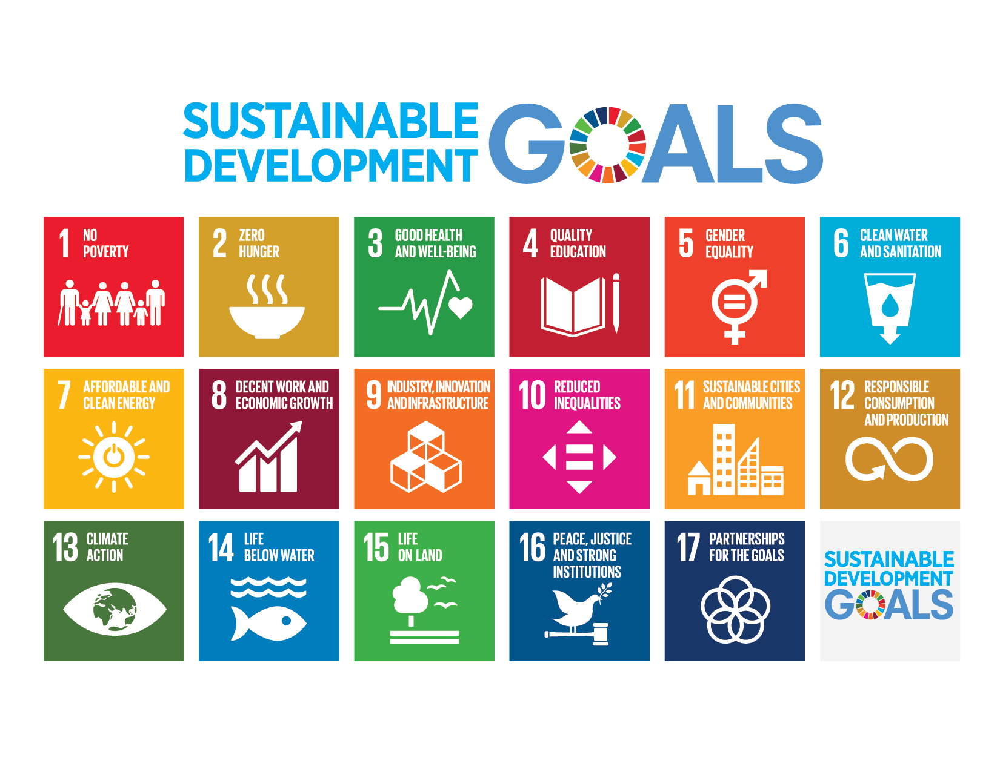
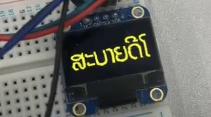

# Bridging the Digital Divide in Agriculture: Displaying Lao Script on Simple Digital Systems

## The Challenge: Unlocking Sustainable Farming in Laos

As digital technology becomes cheaper and more widely available, it can be employed as a very powerful tool in the push for global sustainable development. Simple digital systems can be used in traditionally unautomated and unditized fields such as agriculture to get incredibly valuable results. This is especially important when considering **SDG 2 (Zero Hunger)** and **SDG 13 (Climate Action)**.

In the developing world, much of the food consumed is sourced locally, but the agricultural processes employed to support this demand are often unnecessarily wasteful and environmentally unsustainable. Therefore, smart and efficient farming practices made possible through this digital technology are vital to help alleviate these issues.

However, in Laos, as in other countries with a similar problem, this is exceedingly difficult given the restraints on displaying its language. Lao is a complicated language constructed by using a series of complex consonants that are then appended to by a large array of vowels and tone markers. This is very different from the Latin-based scripts that much of this software was trained on. In order to have this technology employed in rural Laos where Lao is virtually the only understood language, displaying this complex script on simple, small screens with basic microcontrollers is an essential.

> We believe that everyone should have access to this technology regardless of linguistic barriers.

## Our Solution: Fostering Innovation and Inclusivity

This initiative strongly resonates with **SDG 9 (Industry, Innovation, and Infrastructure)** by promoting inclusive and sustainable industrialisation and fostering innovation. By fully documenting this project and making it available on GitHub, we create a culture of open-source innovation, allowing others to adapt and improve upon the technology for various applications beyond agriculture.

This commitment to open access also aligns with **SDG 4 (Quality Education)**, allowing people to learn from and use this technology for their own projects, and have access to a greater range of systems involving microcontrollers and screens, where before, the inability to display the Lao language may have acted as a sticking point.

## Guided by the Principles for Digital Development

The project's design and implementation are deeply rooted in the UNICEF Principles for Digital Development.

* **Design with the User:** The principle of Design with the User was paramount; the system was specifically created to meet the linguistic and informational needs of Lao farmers. By choosing to display information in Lao script, we are ensuring inclusivity and accessibility, a core aspect of Design with the User and allowing for scale within its use case.
* **Use Open Standards, Open Data, Open Source, and Open Innovation:** The open-source nature of the project on GitHub is a direct embodiment of these principles.
* **Reuse and Improve:** This approach prevents vendor lock-in and encourages a collaborative ecosystem where the technology can be adapted for a multitude of purposes.
* **Build for Sustainability:** The technology can be adapted for purposes such as displaying public health announcements. The well-documented nature of the project ensures that others can understand, replicate, and enhance the work, fostering a cycle of continuous improvement.

## Conclusion: The Power of Inclusive Technology

This project shows the power of extending technology to often-overlooked groups of people and in using inclusive and sustainable design practices, as laid out in UNICEF Principles for Digital Development.
